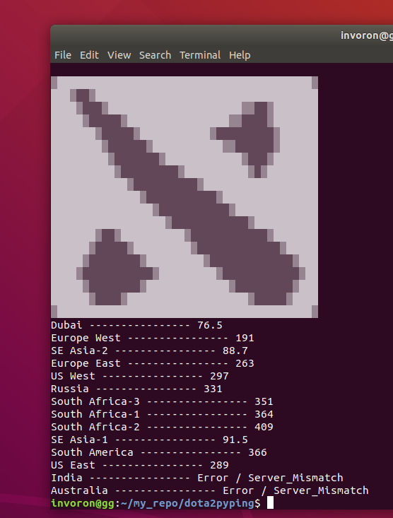

# d2pyping
> fully functional python scripy to ping all major dota2 servers & print result.

No need to open the game to just check your ping. Enjoy Lag Free Game.



## Installation

Linux: (can be modified for windows & osx)

```sh
git clone https://github.com/mahesh-wor/dota2pyping/
cd dota2pyping
chmod +x dota2pyping.py
```


## Usage example
```
python3 dota2pyping
```
## Meta

Mahesh-wor – [@mahesh-wor](https://twitter.com/dbader_org) – maheshwor89@gmail.com

Distributed under the GPL license. See ``LICENSE`` for more information.

[https://github.com/mahesh-wor/dota2pyping(https://github.com/dbader/)

## Contributing

1. Fork it (<https://github.com/mahesh-wor/dota2pyping/fork>)
2. Create your feature branch (`git checkout -b feature/fooBar`)
3. Commit your changes (`git commit -am 'Add some fooBar'`)
4. Push to the branch (`git push origin feature/fooBar`)
5. Create a new Pull Request

<!-- Markdown link & img dfn's -->
[npm-image]: https://img.shields.io/npm/v/datadog-metrics.svg?style=flat-square
[npm-url]: https://npmjs.org/package/datadog-metrics
[npm-downloads]: https://img.shields.io/npm/dm/datadog-metrics.svg?style=flat-square
[travis-image]: https://img.shields.io/travis/dbader/node-datadog-metrics/master.svg?style=flat-square
[travis-url]: https://travis-ci.org/dbader/node-datadog-metrics
[wiki]: https://github.com/mahesh-wor/dota2pyping/wiki
